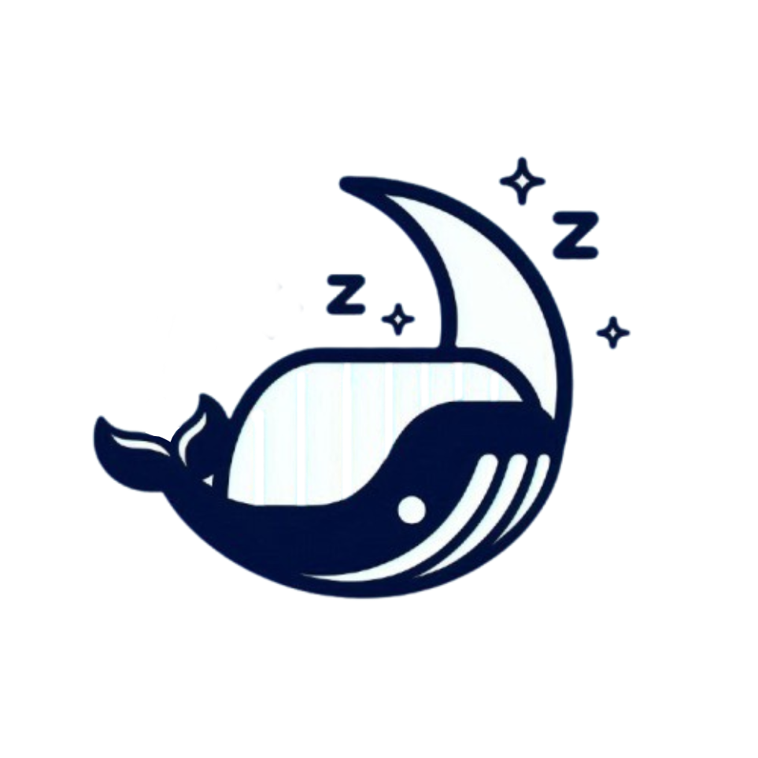

<!-- PROJECT LOGO -->
 

  

 

---
  <h3 align="center">Dockdoser</h3>

  

    Container Watchdog, shuts down containers without traffic and provides a managing dashboard
     
     
    <a href="https://github.com/joao-paulo-santos/Dockdoser/issues">Report Bug</a>
    ·
    <a href="https://github.com/joao-paulo-santos/Dockdoser/issues">Request Feature</a>
  

<!-- ABOUT THE PROJECT -->
## About The Project
